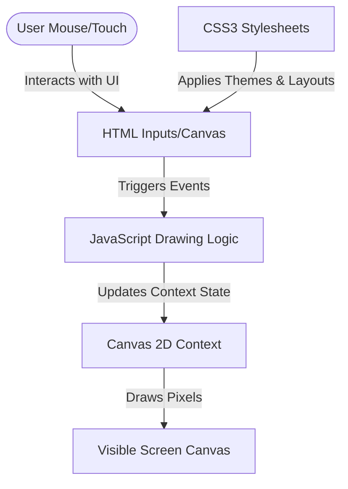

# Canvas Paint Studio: A Beginner's Tutorial on HTML5 & CSS3

Welcome to **Canvas Paint Studio**! This project is an educational, beginner-friendly web application designed to teach you the fundamentals of modern front-end web development. 

By building a simple yet beautiful online painting application, you will learn how **HTML5**, **CSS3**, and **vanilla JavaScript** work in harmony to build rich, interactive experiences directly in the browser—without relying on any external libraries or frameworks.

---

## 🎯 Project Overview and Objectives

The objective of this project is to create an **Online Paint** application where users can draw on a digital canvas, change color and brush size, erase mistakes, clear the canvas, and download their artwork.

### What You Will Learn:
1. **HTML5 Canvas:** How to manipulate pixel grids programmatically.
2. **Modern CSS3:** How to structure pages with Flexbox/Grid and use transitions and shadows to make elements feel premium.
3. **Event-Driven JavaScript:** How to capture mouse/touch movements and draw lines based on user interaction.
4. **Data Flow:** How user input elements (sliders, color wheels) update code states and redraw on-screen pixels.

---

## 🤝 How HTML5, CSS3, and JavaScript Work Together

A web application is similar to a human body:
* **HTML5 (The Skeleton):** Defines the structure, inputs, and canvas workspace. It tells the browser *what* elements exist on the page.
* **CSS3 (The Skin & Clothes):** Designs the visual styles, color themes, spacing, positions, and smooth transitions. It makes the skeleton look beautiful and responsive.
* **JavaScript (The Brain):** Listens to actions (like clicking or dragging), updates internal variables, and draws paths on the canvas. It controls *behavior*.

---

## 📂 The Role of Each File

Our project consists of exactly three files:

1. **[`index.html`](file:///d:/laptrinhweb/index.html)**: Contains the markup skeleton. It defines the toolbar buttons, inputs for colors/sliders, and the `<canvas>` tag.
2. **[`style.css`](file:///d:/laptrinhweb/style.css)**: Holds the visual styling. It uses modern features like glassmorphism, flexbox, and gradients to create a dark-themed, sleek layout.
3. **[`script.js`](file:///d:/laptrinhweb/script.js)**: Runs the application logic. It tracks whether the user is drawing, stores current sizes and colors, and updates the canvas.

---

## 🗺️ Application Architecture

The diagram below shows how data moves from user interface elements (HTML) through styles (CSS) and logic (JavaScript) to render pixels:



---

## 🛠️ Detailed Explanation of HTML5 Features

### 1. The `<canvas>` Element
Historically, drawing graphics on the web required plug-ins like Adobe Flash or Java Applets. HTML5 introduced the native `<canvas>` tag. Think of it as a transparent grid of pixels. In HTML, we declare it:
```html
<canvas id="paintCanvas"></canvas>
```
In JavaScript, we retrieve its "2D Context" to start drawing:
```javascript
const ctx = canvas.getContext('2d');
```

### 2. Semantic HTML Elements
Instead of using generic `<div>` containers for everything, we use HTML5 semantic tags:
- `<header>`: Represents introductory content.
- `<main>`: Contains the main workspace layout.
- `<aside>`: Represents the side column sidebar (used here for our toolbar).
- `<section>`: Houses the canvas container.
*Why?* It helps search engines (SEO) and screen readers read and understand your page layout.

### 3. Native Inputs
- **Color Input (`input type="color"`):** Renders a native, OS-specific color palette selector.
- **Range Input (`input type="range"`):** Renders a slider handle. We use `min="1"` and `max="50"` to bound brush size.

---

## 🎨 Detailed Explanation of CSS3 Features

This project utilizes advanced CSS3 properties to create a high-quality visual theme:

### 1. Flexbox and CSS Grid
- **CSS Grid** is used in `.workspace` to divide the screen into a sidebar (280px wide) and a drawing area (takes up remaining space: `1fr`).
- **Flexbox** handles layout alignments inside the `.toolbar` and buttons, making them stack vertically or flow horizontally without complex margins.

### 2. Border Radius & Box Shadow
- `border-radius: 16px;` rounds the corners of panels and canvas containers for a soft, friendly appearance.
- `box-shadow` applies elevation. We use blurred shadows (`0 10px 30px -10px rgba(0, 0, 0, 0.5)`) to make elements appear to float over the background.

### 3. Gradients
- **Radial Gradients** in `body` create a spotlight effect in the center of the dark background.
- **Linear Gradients** style header text colors by clipping a text gradient using `-webkit-background-clip: text`.

### 4. Transitions and Transforms
- When hovering over buttons, they rise slightly (`transform: translateY(-2px)`) and expand.
- The `transition: all 0.2s cubic-bezier(0.4, 0, 0.2, 1)` property tells the browser to animate changes smoothly, rather than snapping immediately.

### 5. Glassmorphism
- Combining a transparent background (`rgba(30, 41, 59, 0.75)`) with a blur filter (`backdrop-filter: blur(16px);`) creates a "frosty glass" panel look.

### 6. Media Queries
- Media queries allow us to make the page responsive:
```css
@media (max-width: 768px) {
  .workspace { grid-template-columns: 1fr; } /* Stack toolbar above canvas */
}
```

---

## ⚙️ Detailed Explanation of JavaScript Functionality

### 1. Canvas Drawing Basics
To draw a line, JavaScript performs a path sequence:
1. `ctx.beginPath()`: Starts a new drawing path.
2. `ctx.moveTo(lastX, lastY)`: Points the digital pen to previous coordinates.
3. `ctx.lineTo(x, y)`: Draws a straight line path to new coordinates.
4. `ctx.strokeStyle`: Sets the stroke color.
5. `ctx.lineWidth`: Sets the thickness.
6. `ctx.stroke()`: Renders the path line on screen.

### 2. Event Listeners
We track the drawing state by listening to mouse interactions:
- `mousedown`: Set `isDrawing = true` and lock initial drawing coordinate.
- `mousemove`: If `isDrawing` is true, draw a line segment and update coordinate trackers.
- `mouseup` / `mouseleave`: Set `isDrawing = false` to stop lines.
- **Touch Events:** We replicate these coordinates using `touchstart`, `touchmove`, and `touchend` to support iPads and smartphones.

### 3. Eraser Mechanism
Instead of deleting drawn shapes, the Eraser tool draws lines matching the background color (`#ffffff`). This simulates "rubbing out" drawings.

### 4. Clear Canvas
Clearing the canvas uses the 2D context to overwrite the coordinates from edge-to-edge:
```javascript
ctx.fillStyle = '#ffffff';
ctx.fillRect(0, 0, canvas.width, canvas.height);
```

### 5. Saving the Image
The browser can convert canvas states into base-64 text representation representing a file.
```javascript
const url = canvas.toDataURL('image/png');
```
We programmatically construct a temporary link, assign this URL to its source path, and trigger a click download to your local files:
```javascript
const link = document.createElement('a');
link.download = 'my-drawing.png';
link.href = url;
link.click();
```

---

## 📈 Traditional Web vs. Modern HTML5/CSS3

Below is a comparison highlighting how HTML5/CSS3 simplifies what used to require heavy workarounds:

| Feature | Traditional Web (Older HTML/CSS) | Modern Web (HTML5 / CSS3) |
| :--- | :--- | :--- |
| **Graphics Drawing** | Requires external plugins like **Adobe Flash** or **Java Applets**. | Native **`<canvas>`** element drawn programmatically via JavaScript. |
| **Layout Layouts** | HTML table elements or absolute `float` positions (rigid, messy). | **CSS Grid** & **Flexbox** (extremely fluid and responsive). |
| **Icons & Assets** | PNG sprite sheets (high bandwidth, pixelated on zoom). | Scalable Vector Graphics (**SVG**) (infinitely sharp, light file size). |
| **Rounded Corners** | Slice corner images in Photoshop and align them using tables. | Simple CSS property: **`border-radius`**. |
| **Effects (Shadows/Borders)**| Layered background images. | Pure CSS: **`box-shadow`** & **`backdrop-filter`**. |
| **Inputs (Pickers/Sliders)**| Custom heavy JavaScript libraries/widgets. | Native elements: **`type="color"`** and **`type="range"`**. |

---

## 🚀 Running the Project Locally

No installations, Node.js packages, or build configs are required. 

1. Save the three files (`index.html`, `style.css`, and `script.js`) in the same directory.
2. Double-click the **`index.html`** file, and it will run instantly in your browser!
3. Alternatively, start a simple Python server to view it:
   ```bash
   python -m http.server 8000
   ```
   Then open `http://localhost:8000` in your web browser.
